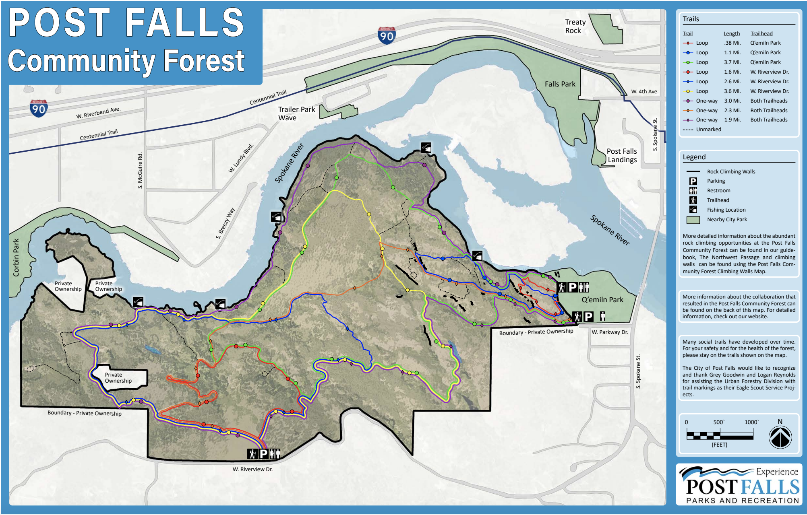
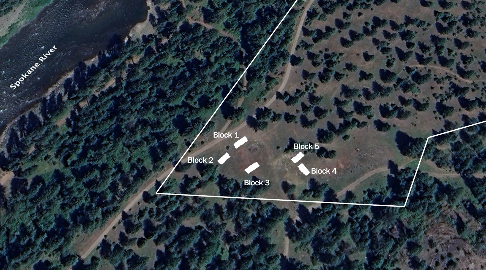
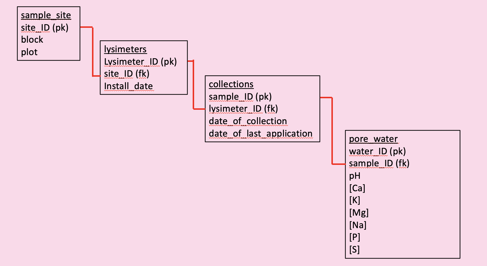

```{r setup, include=FALSE}
knitr::opts_chunk$set(echo = TRUE)
```

## Chapter 1: Post Falls Pore Water Project

Instead of releasing treated municipal waste-water treatment plant effluent directly into water bodies, effluent can be used as irrigation for crops or forested land, providing plants with necessary water as well as essential nutrients. A more complete understanding of the relationship between P mobility and soil properties needs to be developed to better manage P when waste-water is applied to forest or agricultural soils.

In this project, we simulated increased levels of phosphorus found in waste-water by spiking tap water with a sodium phosphate salt. This phosphorus water was then applied to forest soils at three different rates for a six month time period (April 2025 - September 2025). In the center of each plot in this study, a lysimeter was installed for taking pore water samples. The data in this study is based on collections of pore water samples across multiple dates.

### 1.1 Study Sites

This project takes places in the Post Falls community forest in Post Falls, ID (Figure 1.1). 

```{r post_falls_map, fig.cap="Figure 1.1: Map of Post Falls community forest", echo=FALSE}

```


At the site, there are five blocks (Figure 1.2) acting as field replicates, each containing five plots with the following treatment levels: control, water-only, 4.5 kg P/ha/yr, 15 kg P/ha/yr, and 30 kg P/ha/yr. Each plot also has a corresponding lysimeter for pore water collection.

```{r block_map, fig.cap="Figure 1.2: Block layout, oriented with north at the top", echo=FALSE}

```

### 1.2 Project Objectives

The objectives of this project are to investigate the fate and transport of phosphorus in soils. In order to accomplish this goal, we will first design an entity relationship diagram (ERD) to outline the relationships between our datasets (Figure 1.3), then we will develop a matching SQL database and populate the tables with our lysimeter data, finally we will organize our dataset to be optimized for data visualization.  

```{r db_design, fig.cap="Figure 1.3: Entity relationship diagram for Post Falls project", echo=FALSE}

```

## Chapter 2: Setup

### 2.1 Load Packages

We will need the packages `DBI`, `RSQLite`, `tidyverse`, and `dplyr` to connect to our database and create our figures. Additionally, out of personal preference, we will load the `wesanderson` library for custom colors for our plots.

```{r packages, message = FALSE}

library(tidyverse)
library(DBI)
library(RSQLite)
library(dplyr)
library(wesanderson)
library(lme4)
library(lmerTest)

```

Now we need to establish a connection to our `pore-water` database in SQL (this will be done for you by R if no database previously existed).

```{r db}
porewater_db <- dbConnect(drv = SQLite(),
                           "pore-water.db")
```

### 2.2 Creating and populating tables

After connecting to our SQL database, we now need to create our tables.

#### 2.2.1 `sample_site` table

The `sample_site` table includes columns for `site_id` (primary key), `block`, `plot`, and `trt`. This table gives each of our 25 plots a unique `site_id` depending on the corresponding block, plot, and treatment level.

```{r sample_site_table, eval = FALSE, message=FALSE}
dbExecute(conn = porewater_db, 
          statement = "CREATE TABLE sample_site( 
            site_id varchar(5) PRIMARY KEY NOT NULL UNIQUE,
            block varchar(5),
            plot varchar(5), 
            trt varchar(30)
            );")

# load sample_site csv
sample_site <- read.csv("sample_site.csv")

# populate sample_site table in SQL with sample_site data
dbWriteTable(porewater_db, "sample_site", sample_site, append = TRUE)

```

Let's check to make sure our data was uploaded to our SQL database correctly.

```{r sample_site_table_check}
dbGetQuery(porewater_db, "
           SELECT * FROM sample_site LIMIT 3")
```

#### 2.2.2 `lysimeters` table

The `lysimeters` table includes columns for `lysimeter_id` (primary key), `site_id` (foreign key), and `install_date`. This table gives each lysimeter a unique ID which could be helpful if we needed to re-install a previous lysimeter into a different plot, or needed to replace one.

```{r lysimeters_table, eval = FALSE, message = FALSE}
dbExecute(porewater_db, 
          statement = "CREATE TABLE lysimeters( 
          lysimeter_id varchar(5) PRIMARY KEY NOT NULL UNIQUE, 
          site_id varchar(5), 
          install_date text,
          FOREIGN KEY (site_id) REFERENCES sample_site(site_id)
          );") 

# load lysimeters csv
lysimeters <- read.csv("lysimeters.csv")

# populate lysimeters table in SQL with lysimeters data
dbWriteTable(porewater_db, "lysimeters", lysimeters, append = TRUE)

```

Let's check to make sure our data was uploaded to our SQL database correctly.

```{r lysimeters_table_check}
dbGetQuery(porewater_db, "
           SELECT * FROM lysimeters LIMIT 3")
```

#### 2.2.3 `collections` table

The `collections` table includes columns for `sample_id` (primary key), `lysimeter_id` (foreign key), `date_of_collection`, and `date_of_last_application`. This table gives each sample a unique `sample_id` correlating to the lysimeter it was taken from and the date the sample was taken.

```{r collections, eval = FALSE, message=FALSE}
dbExecute(porewater_db, 
          statement = "CREATE TABLE collections( 
          sample_id varchar(5) PRIMARY KEY NOT NULL UNIQUE, 
          lysimeter_id varchar(5), 
          date_of_collection text, 
          date_of_last_application text, 
          FOREIGN KEY (lysimeter_id) REFERENCES lysimeters(lysimeter_id)
          );")

# load collections csv
collections <- read.csv("collections.csv")

# populate collections table in SQL with collections data
dbWriteTable(porewater_db, "collections", collections, append = TRUE)

```

Let's check to make sure our data was uploaded to our SQL database correctly.

```{r collections_table_check}
dbGetQuery(porewater_db, "SELECT * FROM collections LIMIT 3")
```

#### 2.2.4 `water` table

The `water` table includes columns for `water_id` (primary key), `sample_id` (foreign key), `ca_ppm`, `k_ppm`, `mg_ppm`, `na_ppm`, `p_ppm`, `s_ppm`. This table gives each water sample a unique `water_id` correlating to the sample ID. It also gives measurements for a handful of elements.

```{r water_table, eval = FALSE, message=FALSE}
dbExecute(porewater_db, 
          statement = "CREATE TABLE water( 
          water_id varchar(5) PRIMARY KEY NOT NULL UNIQUE, 
          sample_id varchar(5), 
          ca_ppm varchar(10),
          k_ppm varchar(10),
          mg_ppm varchar(10), 
          na_ppm varchar(10), 
          p_ppm varchar(10), 
          s_ppm varchar(10), 
          FOREIGN KEY (sample_id) REFERENCES collections(sample_id)
          );")

# load water csv
water <- read.csv("water.csv")

# populate water table in SQL with water data
dbWriteTable(porewater_db, "water", water, append = TRUE)

```

Let's check to make sure our data was uploaded to our SQL database correctly.

```{r water_table_check}
dbGetQuery(porewater_db, "SELECT * FROM water LIMIT 3")
```

### Chapter 3: Data cleaning and wrangling

Now that we have created and populated our SQL database, let's load our tables into R and tidy the data as needed to prepare for analysis and visualization.

#### 3.1 Loading data

Here we want to query our SQL database to pull our data into our R environment.

```{r tables}

sample_site <- dbGetQuery(porewater_db, "SELECT * FROM sample_site")
lysimeters <- dbGetQuery(porewater_db, "SELECT * FROM lysimeters")
collections <- dbGetQuery(porewater_db, "SELECT * FROM collections")
water <- dbGetQuery(porewater_db, "SELECT * FROM water")

```

#### 3.2 Merging data

Creating one table with all our information for analysis. Having all our data in one place will aid in the creation of our plots. It is vital that we have the concentration of phosphorus found in each of our water samples linked to its corresponding treatment level, as well as the correct block the sample was pulled from. Because treatment levels and blocks are stored in our basal table of `sample_site`, we must connect our tables through the proper foreign keys.

```{r cleaning}

water$sample_id <- as.character(water$sample_id)

pore_water <- water |> 
  full_join(collections, by = "sample_id") |> 
  full_join(lysimeters, by = "lysimeter_id") |> 
  full_join(sample_site, by = "site_id" )

```

#### 3.3 Removing NA's

Remove NA's corresponding to missing samples. When we sample pore water, there is often a few lysimeters that don't produce a sample. For our analysis, we want to remove those NA values.

```{r slice}

pore_water <- pore_water |> 
  slice(-c(44:50))

```

#### 3.4 Transformations

Transform `trt`, `block`, and `date_of_collection` into factors and reorder `trt` into the order needed for analysis. Ensure our element concentrations (`ca_ppm`, `mg_ppm`, `na_ppm`, `p_ppm`, and `s_ppm`) are being treated as numbers, not characters.

```{r transform}

pore_water$block <- as.factor(pore_water$block)
pore_water$date <- as.factor(pore_water$date_of_collection)
pore_water$trt <- as.factor(pore_water$trt) 

pore_water$trt <- factor(pore_water$trt, 
                                levels = c("control", "water-only", "4.5", "15", "30"))

pore_water$ca_ppm <- as.numeric(pore_water$ca_ppm)
pore_water$mg_ppm <- as.numeric(pore_water$mg_ppm)
pore_water$na_ppm <- as.numeric(pore_water$na_ppm)
pore_water$p_ppm <- as.numeric(pore_water$p_ppm)
pore_water$s_ppm <- as.numeric(pore_water$s_ppm)

```

### Chapter 4: Data Visualization

For this project, we want to understand how applying phosphorus to the soil will impact the ability of the soil to sorp phosphorus. The pore water samples help us figure out how much of the phosphorus we are applying is being leached into the pore water instead of being adsorped by the soil. When we analyze our pore water data, we are also curious about what other elements may show up in the soil water, as there can be interactions between the phosphorus and other elements.

#### 4.1 Plotting phosphorus across treatments

We want to visualize the effect of the treatments on the concentration of phosphorus found in our pore water.

```{r plotting_p}

ggplot(pore_water, aes(x = trt, y = p_ppm, group = trt, fill = trt)) +
  geom_boxplot(shape = NA) +
  scale_fill_manual(values = wes_palette("Cavalcanti1", n = 5)) + 
  theme_bw() + 
  labs(x = "Treatment", y = "[P] (ppm)" ) + 
  theme(legend.position = "none")+
  NULL

```

#### 4.2 Comparing phosphorus across treatment and time

Treatments took place from April 2025 to September 2025 and our pore water samples were taken in April and November. Because the pore water samples span the time of our treatments, we want to see if there are changes in the phosphorus concentrations of our treated soils over time.

```{r comparing_dates}

ggplot(pore_water, aes(x = trt, y = p_ppm, fill = date_of_collection)) +
  geom_boxplot(position = position_dodge(width = 0.8)) +
  scale_fill_manual(name = "Sampling Date",
    labels = c("April 2025", "November 2025"), 
    values = wes_palette("Cavalcanti1", n = 5)) + 
  theme_bw() + 
  labs(x = "Treatment", y = "[P] (ppm)", fill = "Sample Date" ) + 
  NULL

```

#### 4.3 Comparing calcium concentrations across treatment and time

Calcium, along with iron and aluminum, is always an important element to look at when working with phosphorus. This is because calcium as the ability to bond with phosphorus in the soil and keep phosphorus in a more stable form, less likely to leach. Let's look at the calcium concentrations of our pore water samples over time. If we see a decrease in calcium concentrations in our pore water, there is a chance that is due to increased bonding activity between P and Ca (further soil analysis would need to be conducted for verification).

```{r comparing_dates_ca}

ggplot(pore_water, aes(x = trt, y = ca_ppm, fill = date_of_collection)) +
  geom_boxplot(position = position_dodge(width = 0.8)) +
  scale_fill_manual(name = "Sampling Date",
    labels = c("April 2025", "November 2025"), 
    values = wes_palette("Cavalcanti1", n = 5)) + 
  theme_bw() + 
  labs(x = "Treatment", y = "[Ca] (ppm)", fill = "Sample Date" ) + 
  NULL

```

#### 4.4 Comparing sodium values across treatment and time 

In this project, we are using a sodium phosphate salt as our chemical in order to apply phosphorus across our site. Because we are not only adding phosphorus to the soil, but increased levels of sodium as well, we want to make sure we are paying attention to the sodium levels of the soil, as well as the pore water. Pore water concentrations are great indicators for elements that are at risk of becoming mobile and leaching through the soil. 

```{r comparing_dates_na}

ggplot(pore_water, aes(x = trt, y = na_ppm, fill = date_of_collection)) +
  geom_boxplot(position = position_dodge(width = 0.8)) +
  scale_fill_manual(name = "Sampling Date",
    labels = c("April 2025", "November 2025"), 
    values = wes_palette("Cavalcanti1", n = 5)) + 
  theme_bw() + 
  labs(x = "Treatment", y = "[Na] (ppm)", fill = "Sample Date" ) + 
  NULL

```

#### 4.5 Statistics 

##### 4.5.1 ANOVA 

Because this project is looking at the effect of applying phosphorus at different rates on forest soils, we want to know if there is a significant difference in the concentration of P found in pore water at the different treatment levels. For this we are going to use a simple one-way ANOVA.

```{r anova}

anova_model_p <- aov(p_ppm ~ trt, data = pore_water)
summary(anova_model_p)

```

There are no significant differences in the phosphorus concentrations found in the pore water samples of the different treatment levels. 

##### 4.5.2 Mixed Model Effects

We are also curious if there was a treatment effect over time. To test this, we are going to run a mixed effect model to look at `trt`, `date_of_collection`, and `p_ppm` all together.

```{r mixed_effects_model}

model <- lmer(p_ppm ~ trt * date + (1 | block), data = pore_water)
summary(model)

```

There are no significant differences in phosphorus concentrations across different collection dates.
